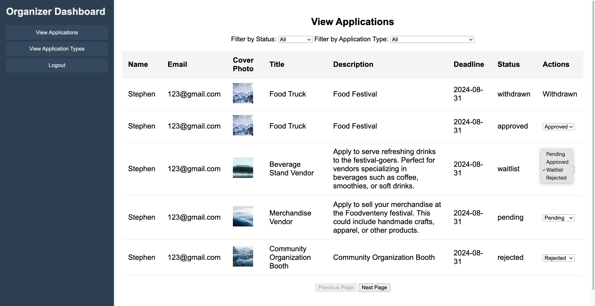

# Foodventeny Festival Application Management

This project is designed to facilitate the management of vendor applications for the Foodventeny festival. It provides functionalities for both vendors and event organizers to manage and process applications seamlessly.

## Features

### Authentication:

- **Login**: Users can log in using their credentials.
- **Account Creation**: Users can create either a vendor or event organizer account.
- **User Types**: Separate interfaces and functionalities are provided based on whether the user is a vendor or an event organizer.
  

### Event Organizer Side:

- **Create Application Types:** Organizers can create and manage different types of applications, such as for food trucks, tabling spaces, etc.
  
- **View Applicant Submissions:** Organizers can view a list of submitted applications and filter them by status or type.
- **Manage Application Status:** Organizers can update the status of applications, such as approving, rejecting, or waitlisting applicants.
  

### Vendor Side:

- **View Application Types:** Vendors can view available application types and apply to them.
- **Submit Applications:** Vendors can submit applications for the available application types.
  
- **Track Application Status:** Vendors can track the status of their submitted applications.
  

### Pagination

- **View Applications with Pagination**: Both vendors and organizers can navigate through their applications with next and previous buttons.
- **Filters and Sorting**: Applications can be filtered by status and type, and pagination is adjusted accordingly.

## Technologies Used

- **Backend:** PHP
- **Frontend:** HTML, CSS, JavaScript (Vanilla)
- **Database:** MySQL
- **Containerization:** Docker & Docker Compose

## Setup

### Prerequisites

- Docker & Docker Compose
- Git

### Steps

1. **Clone the Repository**

   ```bash
   git clone https://github.com/Stephen0023/foodventeny.git
   cd foodventeny
   ```

2. **Start the Application**

   ```bash
   docker-compose up --build
   ```

3. **Access the Application**
   - The application will be available at `http://localhost:9090`.

## Folder Structure

- `backend/`: Contains the PHP backend code, including models, controllers, and routes.
- `frontend/`: Contains the static HTML, CSS, and JavaScript files for the frontend.
- `uploads/`: Stores uploaded files, such as cover photos for application types.
